# CSS

## CSS의 간단한 설명

- 스타일 시트 언어
- 폭포수, 계단식으로 작동하는 스타일 설정
- HTML 요소를 선택하고 선택한 요소에 대한 스타일을 지정
- 사이트의 모양, 레이아웃, 색상 지정 가능

## CSS 특징

- 외부 파일에서 불러와 HTML 파일에 적용할 수도 있고, HTML 파일 내부에서 직접 스타일을 지정할 수도 있음
- 캐스캐이딩(cascading)이라는 개념을 사용하여, 여러 스타일 규칙이 적용될 경우 우선순위를 결정
- 한 요소에 대해 여러 스타일 규칙이 적용될 경우, 가장 구체적인 스타일이 적용

- 장점 : 일관성 있고 전문적인 디자인을 구현 가능

## CSS 특성

- 폭포수, 상속, 우선순위

### 폭포수

- 같은 태그에 대한 규칙이 있는 경우
  -> 마지막으로 작성된 규칙으로 적용

### 상속

- 부모 요소의 CSS 규칙을 자식요소가 상속 받아 적용
  -> div가 바뀌면 div 안의 자식들도 바뀜 
- 하지만,
  -> 자식요소가 CSS 규칙을 가지고 있다면 우선으로 적용

### 우선순위

- CSS 규칙이 서로 충돌할 때 어떤것을 적용할 지
- html 내에서 바로 style을 선언할 경우 나중에 오류 발생 시 우선순위 찾기가 힘들어짐

- 우선 순위 점수 사진

  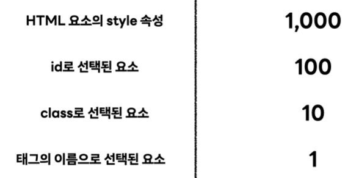

## CSS 적용 하는 법

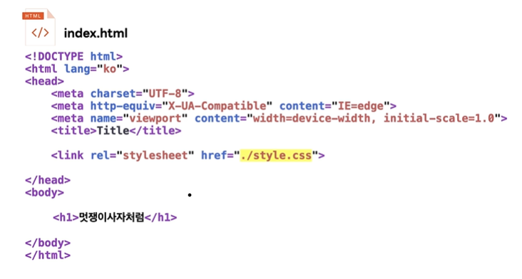  
- <link> 사용
- 주의 할 점 : html과 같은 파일 경로에 css파일이 있는지 확인 해야 함

## 일반적인 속성

- font-family: 글꼴을 지정
- font-size: 글꼴 크기를 지정
- color: 글꼴 색상을 지정
- background-color: 배경 색상을 지정
- width: 너비를 지정
- height: 높이를 지정
- border: 테두리 스타일을 지정
- margin: 바깥쪽 여백을 지정
- padding: 안쪽 여백을 지정

## CSS BOX

- CSS 규칙에서 display속성에 inline, block값을 가짐 
- 태그에 따라 해석

### inline

- 한 줄에 표시
- a, img, span
- 태그로 감싸진 내용만큼만 영역을 차지
- width와 height로 요소의 크기 조절 할 수 X
- inline은 좌우 margin, padding만 적용 O
    > 다른요소 간의 관계를 결정 짓는 요소 사용이 제한됨
      inline에 적용되는 것처럼 보이는 상하 padding은 레이아웃에 영향을 미치지 못함

### block

- 개별 요소마다 줄을 바꿈
- h1, p, div
- width와 heigth로 요소의 크기 조절
- 내용과 별개로 자신의 영역을 가짐
- 너비를 설정하지 않으면 끝까지 이어짐

### inline-block

- 둘의 특징을 모두 포함
- 줄을 바꾸진 않음
- block처럼 width와 height를 가짐
- 상하 margin, padding이 레이아웃에 유효함

### Margin

- 테두리로부터 다른 요소까지의 거리
- px 단위
- 방향은 시계방향 -> 상 우 하 좌 ()

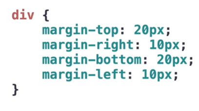

### Border

- 내용을 둘러싼 테두리

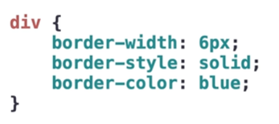

### Padding

- 내용으로부터 테두리까지의 거리
- ppt에서 사각형 텍스트 박스안에 글쓰는 거라고 생각

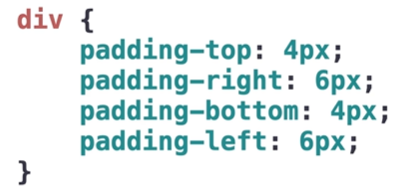
## Box_Sizing

- 박스에 적용된 사이즈의 기준 정하기

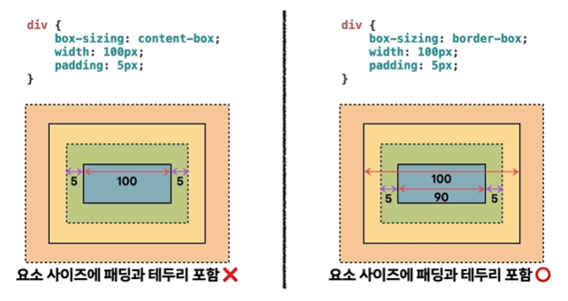  
- content-box : 내용이 차지하는 영역에만 사이즈가 적용
    > 단점 : 위의사진 처럼 생각했던 요소의 크기 보다 크게 나올 수 있음
        -> 해결 방법 : universal selector로 전체적용
          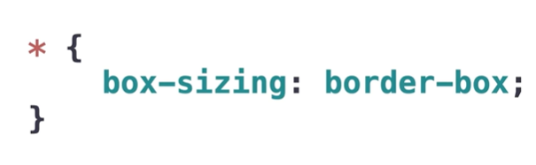
        
- border-box : 테투리, 내용 포함해서 하나의 사이즈로 적용
               왜곡 되지않은 사이즈로 뽑을 수 있음

## CSS 기본 구조 (요소를 정하는 방법)

- 선택자(selector)  
  
  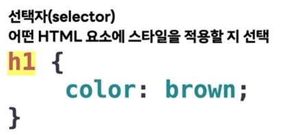

- 속성(property) 
  > html이랑 영어가 다름, 영어 조심할 것  
  
  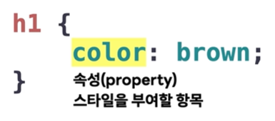

- 값(value)   
  
  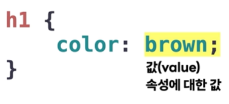 

- 선언(delaration)  
  
  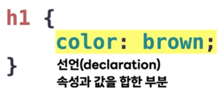

- 규칙(rule)  
  
  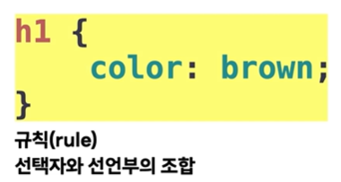

- 요소 전체에 적용(universal)
  > 단점 : 부분적으로 수정할 때 곤란한 상황이 생김  
  
  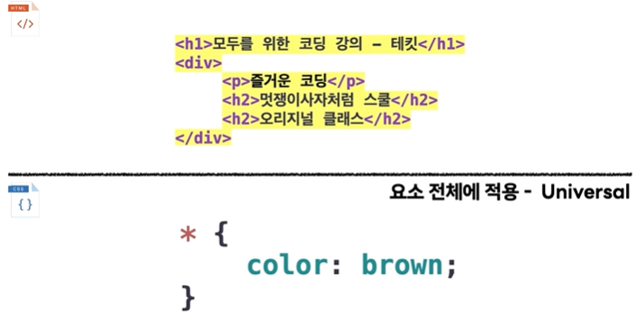

- 특정 태그 전체에 적용
  > 단점 : 다른 곳에 같은 헤드를 썼을 떄 중첩되어 변경 될 수 있음  
  
  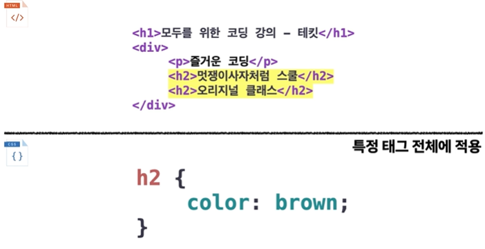

- 여러 태그 전체에 적용  
  
  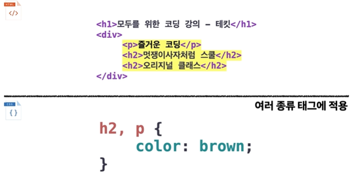

- 특정 클래스에 해당되는 요소에 대해 적용  
  
  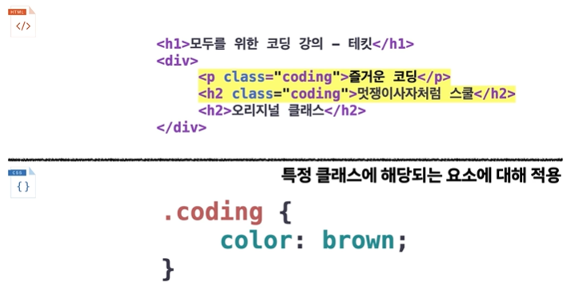

- 특정 클래스가 명시된 특정 태그에 대해 적용

  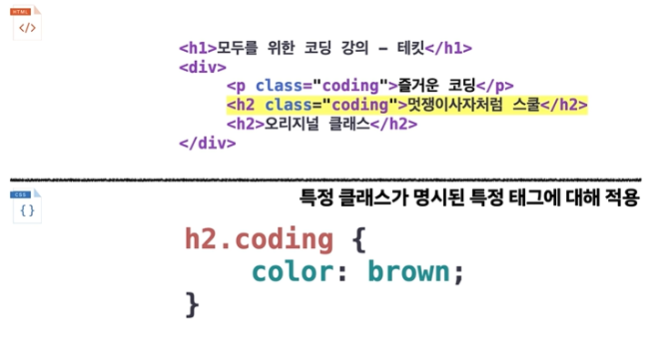

- 특정 아이디에 해당되는 요소에 대해 적용

  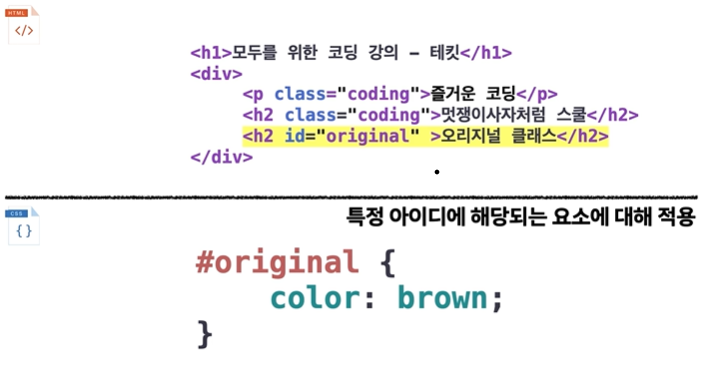

- 특정 아이디가 명시된 특정 태그에 대해 적용

  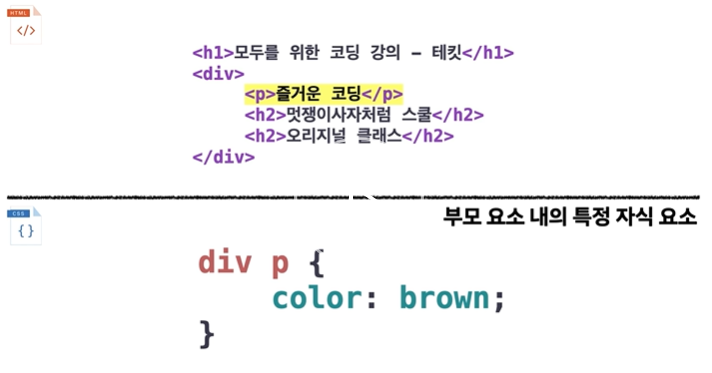

- 부모 요소 내의 특정 자식 요소

  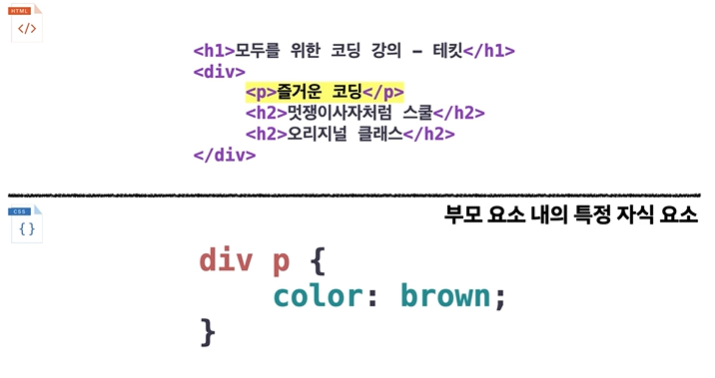

## CSS 주석

- /* ~~~ */ 를 사용

## CSS 단위

- 스크린 환경에 적합한 단위
- px, %, em/rem

### px

- 스크린을 구성하는 작은 점

### %

- 부모 요소를 기준으로 크기 설정
   -> 부모의 크기에 퍼센트 만큼 크기

### em/rem

- em : 부모 요소의 폰트 크기
- rem : 루트 요소의 폰트 크기

- 폰트 크기에 비례해서 크기 설정  
- 최상위 요소인 HTML의 폰트 사이즈를 기준으로 크기 설정
- 통일된 기준을 잡기 위해서는 rem 단위 사용 권장

### vw/vh

- v = viewport
- 각 디바이스별 화면의 너비/높이를 기준으로 배율 설정
- 기기가 달라도 동적으로 작동할 수 있게 함

## 이미지 다루기

- inline이여서 크기 너비 다루기가 어려움
- object-fit: 을 사용
     - cover : 이미지를 부모 요소의 영역의 크기만큼 채움
     - cotain : 이미지의 원래 비율을 유지하면서 크기를 변경하여 부모 요소를 채움
     - fill : 이미지 비율을 유지하지 않고 부모 요소 크기에 맞게 변경하여 채움

## Overflow

- 브라우저 입장에서 요소가 넘치는 것은 에러가 아님
- 인간의 눈에는 형식에 벗어나서 오류라고 생각 할 수 있음
- overflow 뒤에
     - -hidden을 주면 부모영역을 벗어나는 것을 안 나타나게 함
     - -(x,y) 축의 값을 적고 : scroll을 쓰면 스크롤 사용
     - : auto를 쓰면 컴퓨터가 자동으로 

## 폰트 꾸미기

### 색상
- color : 원하는 색깔   
- 영어에 제한이 있기 때문에 Hex color 사용 (Red/Green/Blue)  
- #000000 -> # 뒤에 6자리  
  
### 크기
- font-size: 크기;
  
### 글자 기울기
- font-style: italic
  
### 글자 굵기
- fotn-weight: bold

### 글자 밑줄
 - text-decoration: underline   
 - text-decoration: non -> 밑줄 표시 제거

### 링크 구분
- 그림과 같이 순서를 맞게 하기  

  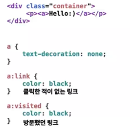

## 테두리 꾸미기

- 기본

  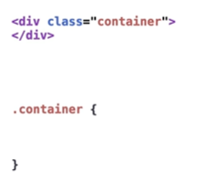

- 모서리 둥글게 : border-radius:

## 배경 이미지

### 색깔
- background-color:

### 이미지
- background-image: 경로
- div 크기를 넘어가면 짤림

### 패턴
- background-repeat:
- 반복 안하려면 :뒤에 no-repeat

### 크기
- background-size:
- cover : 요소의 배경을 모두 덮는 것이 우선
- contain : 이미지가 온전히 나오게하는 것이 우선

### 위치
- background-position

## 정렬

### 가운데 정렬

- margin: 0 auto
- 하지만, 가운데 정렬이 안된다면 부모 요소의 width를 확인 해볼것!

### text-align:center

- 부모 요소가 block
- 정렬하려는 자식 요소가 inline일 때 가능

## Position

### static

- static은 모든 요소의 디폴트 값 생성된 원래 위치

### relative

- 거리 이동
- left: 50px이면 왼쪽으로 부터 50px 만큼 움직임

### absolute

- 가장 가까운 부모를 기준
- body를 기준으로 위치를 움직임
- margin에 영향 안받음

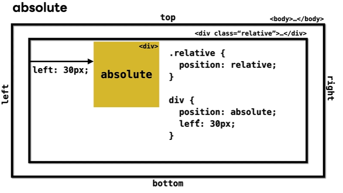

### fixed

- 브라우저 영역에 항상 고정

### sticky

- 스티커 처럼 계속 붙어 있는 개념

## div

- 간단하게 영역으로 생각
- 여러 요소들을 하나로 묶어줌
- 기본은 네모 형태, 테두리 있음(네모를 깎아내서 동그랗게, 테두리 종류 등 변경 가능)
- 각 영역 안에서 적용되는 글씨 크기나 색상 또는 안의 예를 들어 버튼이나 입력창 같은 것의 위치도 조정 가능(position 사용)
- 같이 있어서 상호작용 해야 하는 것들을 묶어 놓으면 편할거 같다
