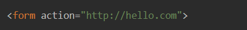

# html 

## html의 간단한 설명
- 텍스트에 생명을 불어넣는 것
- 구조/내용을 다룸

## HTML요소(element)
  - 텍스트 조각
  - 태그를 붙이는 작업 markup
  - 뒤에오는 태그에는 /를 붙여주기

 자주 사용되는 요소

    
: 문단
    <a>: 링크(anchor)를 나타내며, href 속성을 사용하여 링크 대상의 URL을 지정
    >  a {
            color: inherit;          -> 글자 색 변경 X
            text-decoration: none;   -> 링크 밑줄 X
        }
          
    : 이미지를 나타내며, src 속성을 사용하여 이미지 파일의 경로를 지정
      > div로 마크업 후 사용  
        src ="경로"  
        alt ="대체 문구"  
    <li> : 목록을 나타내는 것
    <ul>: 번호가 없는 목록(unordered list)을 나타내며, <li> 요소를 포함
    <ol>: 번호가 있는 목록(ordered list)을 나타내며, <li> 요소를 포함
    <table>: 표(table)를 나타내며, <tr> 요소를 포함하고 각 행(row)은  <td> : 요소를 포함
    <h1 ~ 6> : 제목
     : 텍스트의 일부분만 영향을 주기 위해 사용, 의미를 부여하지는 않음
    
 : 여러가지 HTML 요소를 묶어 그룹화 
    <form> : 단순한 요소가 아니라 사용자(클라이언트)와 웹 서버가 서로 통신하는 기술 중 하나의 방법
    HTML을 작성할 때 주로 사용자에게 정보를 입력받거나 전달받기 위해 사용되는 요소
  
     - GET, POST 이 두 가지 방식만 사용
     - GET과 POST의 차이는 데이터를 보낼 때 body가 없느냐(GET), body가 있느냐(POST)가 가장 큰 차이점

     - 예시
         

          
     - Get

     -Post

     - action 속성 : 어떤 기능을 요청할지 정의( 값은 반드시 유효한 URL )
      
       도메인의 URL을 기준

       상대 경로를 사용해 같은 토메인의 URL을 기준

     <fieldset> : 일반적으로 <form> 요소 안에서 사용, 관련된 폼 컨트롤들을 묶어서 하나의 그룹으로 만들고, 이 그룹에 대한 설명을 제공하는 역할

     - 예시
      <form>
       <fieldset>
         <legend>개인 정보</legend>
         <label for="name">이름:</label>
         <input type="text" id="name" name="name">  
         <label for="email">이메일:</label>
         <input type="email" id="email" name="email">  
        </fieldset>
      </form>
      <legend> : <fieldset> 요소에 대한 설명을 제공
      <input> : 사용자로부터 텍스트를 입력받는데 사용
        - type="text" 속성은 입력 필드가 텍스트 입력 필드임을 나타냄
      <button> 요소: 이 요소는 사용자가 클릭할 수 있는 버튼을 나타냄

  
## HTML속성(attribute)
  - 요소(element)에 대한 추가 정보를 제공
  - 일반적으로 태그의 시작 부분에 작성

> 일반적인 속성

     class: 요소를 그룹화하거나 스타일 적용에 사용하는 클래스 이름을 지정
     id: 요소의 고유한 식별자를 지정
     style: 요소에 스타일을 적용하기 위한 CSS 코드를 지정
     title: 요소에 대한 추가 정보를 제공하는 툴팁을 지정
     href: 링크 요소에서 링크 대상의 URL을 지정 
           ->target="_blank" 사용하면 새로운 창으로 나타남 

## HTML주석
- 작성은 되어있는 코드를 브라우저 화면에 뜨지않도록 하는 것
- ctrl + /

> 조심해야할 점
     브라우저에 뜨지않는다고 남용하지 말 것
     주석을 포함한 모든 내용을 받아감   
     이유 -> 주석처리를 한 개인정보 등 중요한 것이 브라우저를 통해 노출 될 수 있기 때문!

## HTML head
### 이미지 추가 설명

#### !DOCTYPE html
- html문서라는 것을 선언해주는 것

#### html lang="ko"
- 이 html이 무슨 언어로 되었는지 알려주는 것

#### head
- 브라우저 화면에 안나타남
- 웹문서의 속성, 인코딩 방식, 외부 리소스를 로드하는 설정 같은 성격

#### meta charset="UTF-8"
- meta 태그는 여러개 있을 수 있고 안에 있는 attribute에 따라 용도가 달라짐
- utf-8은 다른 언어가 깨지는 걸 막아줌

#### meta http-equiv="X-UA-Compatible" content="IE=edge"
- 브라우저 호환성을 맞춰주는 용도
- 왜냐하면 버전에 따라 같은문서를 다르게 해석한 적이 있기 때문

#### nama="viewport" content-"width=device-width, initial-scale=1.0"
- 기계에 따라 너비를 맞추기 위함

#### title
- <title> 제목 </title>

## HTML은 블록과 인라인 요소로 나뉜다

### 이미지 추가 설명

### 블록 요소
- 브라우저에서 하나의 면을 차지하는 것
- 대표 예시 h, p, ol, ul, li, div

### 인라인 요소
- 특정 텍스트 영역에만 영향을 미침
- 선을 그린다고 생각
- 대표 예시 a, span

## HTML body

### 이미지 추가 설명

### 줄바꿈
- br : line break, 문장 사이에 넣으면 줄바꿈이 됨 (단일 태그)

### 링크 연결
- a : href와 함께 사용하여 연결할 링크 나타냄 (a href="링크" ~~ /a)

