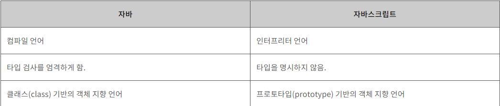
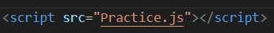
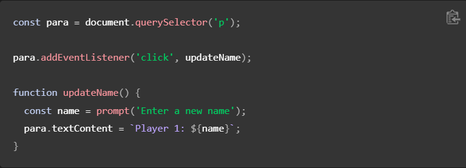
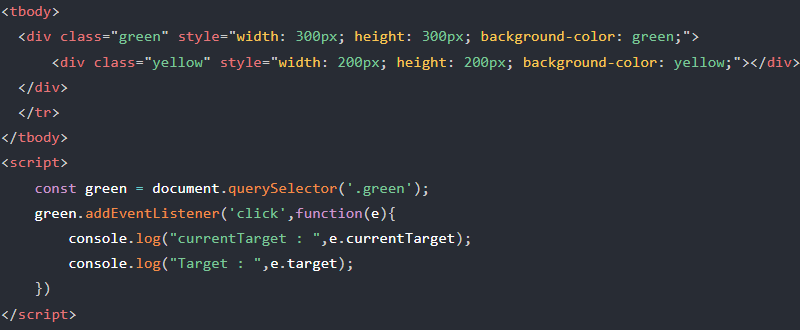
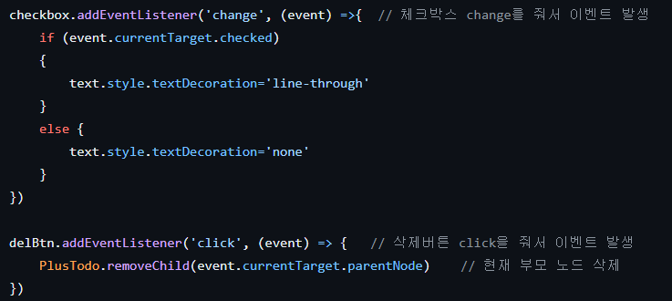

# JavaScript

## 정의

  - 자바스크립트(JavaScript)는 객체(object) 기반의 스크립트 언어
  - 웹의 동작을 구현

## 특징

  - 자바스크립트는 객체 기반의 스크립트 언어
  - 자바스크립트는 동적이며, 타입을 명시할 필요가 없는 인터프리터 언어
  - 자바스크립트는 객체 지향형 프로그래밍과 함수형 프로그래밍을 모두 표현

## 자바 VS 자바스크립트

1. 목적과 사용 분야

 - 자바: 자바는 범용 프로그래밍 언어로, 주로 엔터프라이즈 소프트웨어 개발이나 안드로이드 애플리케이션 개발에 사용됨. 서버 애플리케이션, 모바일 애플리케이션, 게임 등 다양한 분야에서 활용됨
 
 - 자바스크립트: 자바스크립트는 웹 페이지에서 동적인 기능을 구현하기 위해 사용되는 스크립트 언어. 주로 웹 프론트엔드 개발에서 HTML 및 CSS와 함께 사용되며, 최근에는 서버 사이드 개발을 위한 Node.js와 같은 플랫폼에서도 사용됨

2. 실행 환경

 - 자바: 자바 프로그램은 Java Virtual Machine (JVM) 위에서 동작함. 따라서 자바 프로그램은 플랫폼에 독립적이며, 한 번 작성하면 여러 운영체제에서 실행할 수 있음
 
 - 자바스크립트: 자바스크립트는 웹 브라우저 환경에서 주로 실행됨. 최근에는 Node.js와 같은 런타임 환경을 통해 서버 측에서도 실행할 수 있게 됨.

3. 문법

 - 자바: 자바는 정적 타입 언어임. 변수의 데이터 타입을 명시적으로 선언해야 하며, 컴파일 시간에 오류를 체크할 수 있음. 클래스와 객체 지향 프로그래밍 개념이 중요한 요소임.
 
 - 자바스크립트: 자바스크립트는 동적 타입 언어임. 변수의 타입을 명시적으로 선언할 필요가 없으며, 실행 중에 타입이 동적으로 결정됨. 프로토타입 기반의 객체 지향 프로그래밍 개념이 중요한 요소임.

## 자바 Script 태그

- 웹 브라우저에서 실행될 때 현재 문서에 새로운 HTML 요소를 추가하는 코드

- HTML 파일에 그림과 같이 작성

- JavaScript 파일에 그림과 같이 작성

- HTML에서 로드 되는 위치가 중요함
- 일반적으로 body 마지막 부분
    - 중간에 Script를 쓰게 되면 기존에 진행 되던 파싱 작업이 중지 되기 때문에

## 변수

- 값을 저장하고 참조할 수 있는 식별자
- 값의 유형에 따라 자동으로 유형이 결정
    -  JavaScript에서는 동적 타입(dynamic typing)을 사용하기 때문
- "var", "let", "const"

- "var" 
  - 예전부터 사용되어온 변수 선언 키워드, 하지만 이제는 잘 사용하지 않음
  - 함수 스코프를 가짐 즉, 함수 내에서 선언된 변수는 함수 내에서만 접근할 수 있음. 함수 밖에서 선언된 변수는 전역 스코프를 가지며, 어느 곳에서든지 접근할 수 있습니다.
  - 변수의 재선언이 가능함
   
- "let"
  - 블록 유효 범위(block-scoped)를 가지는 변수를 선언할 때 사용함. 
  - 이전에는 var로 변수를 선언하면 전역(global) 유효 범위를 가지기 때문에 예기치 않은 문제가 발생하기도 했는데, let을 사용하면 해당 블록에서만 유효하기 때문에 코드의 가독성과 안정성을 높일 수 있음.

- "const"
  - 상수(constant)를 선언할 때 사용함.
  - let과 마찬가지로 블록 스코프를 가짐.
  - 변수의 값을 변경할 수 없음. 상수로 선언된 변수는 값을 재할당할 수 없음.
  - 변수의 재선언이 불가능함. 

### var를 잘 안쓰는 이유
-  ES6 이후에는 var보다는 let과 const를 사용하는 것을 권장합니다. 이는 블록 스코프를 사용함으로써 변수의 생명주기를 더욱 명확하게 관리할 수 있기 때문입니다.
    - 스코프 : 변수에 접근할 수 있는 범위
        - 전역 스코프(global)는 어디에서든 해당 변수에 접근 가능한 걸 의미한다. (전역변수)
        - 지역 스코프(local)의 경우, 한정적인 범위에서 해당 변수에 접근이 가능하다. (지역변수)
        - 블록 스코프는 블록({})내부에서 선언된 변수는 해당 블록에서만 접근 가능
## DOM 

- 정의
  - 웹 페이지의 문서(document)를 나타내는 계층적인 객체 모델
  - HTML, XML 등의 문서를 프로그래밍적으로 조작할 수 있는 방법을 제공

- 트리 구조로 이루어져 있음
  - 최상위 노드는 document 객체로 시작하며, 그 아래로 요소(element), 속성(attribute), 텍스트 등의 노드들이 계층적으로 구성
  - 문서의 각 요소(element), 속성(attribute), 텍스트(text) 등을 객체(object)로 표현
  - 객체들은 자바스크립트를 사용하여 동적으로 생성하고 수정

- 웹 페이지의 요소들을 계층적으로 구성
  - 요소들 사이의 관계와 위치를 파악

- 웹 브라우저에서 내부적으로 사용
  - 자바스크립트를 통해 외부에서도 접근
  - 웹 페이지를 동적으로 조작하거나, 사용자 입력에 따라 웹 페이지를 변경

- 메서드와 속성
  - getElementById: 주어진 id 값을 가진 요소를 가져옴
  - getElementsByClassName: 주어진 클래스 이름을 가진 요소들을 가져옴
  - getElementsByTagName: 주어진 태그 이름을 가진 요소들을 가져옴
  - querySelector: CSS 선택자를 사용하여 요소를 선택함
  - innerHTML: 요소의 내부 HTML 콘텐츠를 가져오거나 설정함
  - appendChild: 요소의 자식 노드로 새로운 노드를 추가함
  - removeChild: 요소의 자식 노드를 제거함
  - setAttribute: 요소의 속성을 설정함
  - addEventListener: 요소에 이벤트 리스너를 추가함
## 이벤트

- 정의
  - 이벤트(event)란 웹 페이지에서 발생하는 모든 동작

- 종류
  - 마우스 이벤트: click, dblclick, mousedown, mouseup, mousemove 등
  - 키보드 이벤트: keydown, keyup, keypress 등
  - 폼(form) 이벤트: submit, reset, focus, blur 등
  - 윈도우(window) 이벤트: load, unload, resize, scroll 등

  ## 예시

  

  - 변수에 값을 저장. 바로 위의 예제를 보면, 요청해서 받은 새로운 이름을 name이라는 변수에 저장.

  - 프로그래밍에서 "문자열"(string)이라고 부르는, 텍스트 조각을 조작. 위 예제에서는 문자열 "플레이어 1: "과 name 변수의 값을 합쳐 온전한 텍스트 레이블("Player 1: Chris")을 생성합니다.

  - 웹 페이지에서 발생하는 어떤 이벤트에 코드가 응답하도록 함 예제에서는 click 이벤트를 사용해서 레이블을 클릭하는 순간을 탐지하고, 그 후에 텍스트 레이블을 업데이트 함

  ## 키워드
    - 자바스크립트에서 특정한 의미와 기능을 가지는 단어
    - 이런 기능들이 정의되어 있기 때문에 식별자(변수 이름이나 함수 이름)로 사용 불가

  ### 종류
 - break: 반복문이나 switch 문에서 실행을 중단하고 빠져나올 때 사용됨
 - case: switch 문에서 조건에 해당하는 경우를 정의할 때 사용됨
 - catch: try-catch 문에서 예외를 처리할 때 사용됨
 - continue: 반복문에서 현재 반복을 중단하고 다음 반복으로 넘어갈 때 사용됨
 - debugger: 코드 실행을 중단하고 디버깅을 위해 개발자 도구를 열어줌
 
 - default: switch 문에서 어떤 case에도 해당하지 않는 경우를 정의할 때 사용됨
 - delete: 객체에서 속성을 삭제할 때 사용됨
 - do: 조건을 검사하기 전에 먼저 루프의 코드를 실행할 때 사용됨
 - else: if 문에서 조건이 거짓인 경우 실행할 코드 블록을 정의할 때 사용됨
 - finally: try-catch 문에서 예외 발생 여부와 관계없이 항상 실행할 코드 블록을 정의할 때 사용됨
 
 - for: 반복문을 정의할 때 사용됨
 - function: 함수를 정의할 때 사용됨
 - if: 조건문에서 특정 조건을 검사하고 실행할 코드 블록을 정의할 때 사용됨
 - in: 객체의 속성이 존재하는지 확인할 때 사용됨
 - instanceof: 객체가 특정 클래스의 인스턴스인지 확인할 때 사용됨
 
 - new: 객체의 인스턴스를 생성할 때 사용됨
 - return: 함수에서 값을 반환할 때 사용됨
 - switch: 다중 분기 조건문을 정의할 때 사용됨
 - this: 현재 객체를 참조할 때 사용됨
 - throw: 예외를 발생시킬 때 사용됨

 - try: 예외가 발생할 가능성이 있는 코드 블록을 정의할 때 사용됨
 - typeof: 피연산자의 데이터 타입을 반환함
 - var: 변수를 선언할 때 사용됨 (ES5에서 사용되며, let과 const로 대체됨 – 자세한 내용은 위에 있으니 참고)
 - void: 함수에서 반환 값을 명시적으로 지정하지 않을 때 사용됨
 - while: 조건이 참인 동안 반복 실행할 때 사용됨
 
 - with: 특정 객체의 속성에 대한 접근을 간편하게 만들기 위해 사용됨 (사용을 권장하지 않음)
    - 가독성과 유지보수성: with 문을 사용하면 코드가 더 간결해지기는 하지만, 해당 객체의 속성에 접근하는 부분이 명시적으로 표현되지 않아 가독성이 떨어지고 코드의 의도를 파악하기 어려워집니다. 또한, with 문이 사용된 블록 밖에서 해당 객체의 속성을 참조하는 경우 어떤 객체인지 명확하지 않을 수 있으므로 유지보수가 어려워집니다.

   - 오류 가능성: with 문은 해당 객체의 속성에 접근할 때, 객체에 속성이 없는 경우 전역 변수로 간주될 수 있습니다. 이는 의도치 않은 결과를 초래할 수 있고, 버그를 유발할 수 있습니다. 이러한 오류를 발견하고 디버깅하는 것은 어려울 수 있습니다.
 
   - 성능 저하: with 문은 실행 시간에 동적으로 스코프 체인을 생성하여 객체의 속성에 접근합니다. 이는 코드 실행 시 스코프 결정에 추가적인 비용을 발생시킬 수 있으며, 성능 저하를 초래할 수 있습니다.
 

 ## 예약어

 - 아직 특별한 쓰임새는 없지만 미래에 키워드로 쓸 가능성이 있어서 예약해 둔 단어
 - 개발자가 변수명이나 함수명 등으로 사용할 수 없는 단어

 ### 종류
 - class: 객체 지향 프로그래밍에서 클래스를 정의할 때 사용됨
 - const: 상수를 선언하고 값을 할당할 때 사용됨 한 번 할당된 값은 변경할 수 없음
 - export: 모듈에서 함수, 객체, 변수 등을 다른 파일에서 사용할 수 있도록 내보낼 때 사용됨
 - extends: 클래스가 다른 클래스를 상속받을 때 사용됨
 - import: 다른 파일에서 모듈, 함수, 객체, 변수 등을 가져올 때 사용됨
 - let: 블록 범위의 변수를 선언할 때 사용됨
 - super: 하위 클래스에서 상위 클래스의 메서드를 호출할 때 사용됨
 - yield: 제너레이터 함수에서 값을 반환하거나 일시 중단할 때 사용됨

## currentTarget vs target
 
 

 - 위의 코드를 실행하면 녹색 박스안에 노란색 박스가 들어있습니다. 그리고 addEventListener를 녹색 박스에 이벤트를 걸었습니다.

 - 먼저 녹색 div를 클릭하시면 두 요소 모두 녹색 div를 가리킵니다. 그리고 노란색 div를 클릭하시면 currentTarget은 녹색 div, target은 노란색 div를 가리킵니다.

간단하게 말하면
 - currentTarget : 이벤트 리스너가 달린 요소
 - target : 실제 이벤트가 발생하는 요소

## todolist

- todolist 만들면서 삭제 버튼이랑 체크버튼을 예시
- click, change 같은 이벤트를 두고 event 매개변수를 이용하여 해당 이벤트를 처리하는 중인 요소(HTML 요소)를 가리키는 참조를 얻을 수 있다.